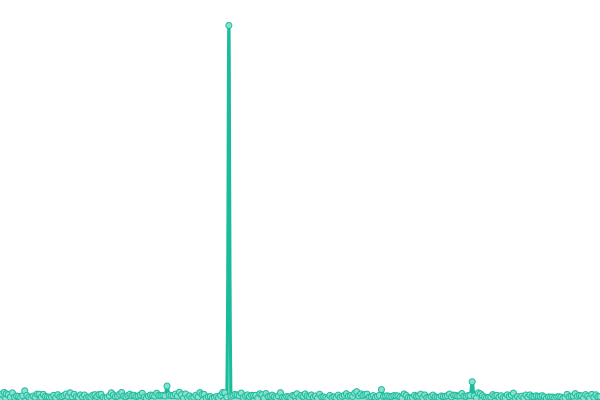

# [📈 Live Status](https://binusmayadown.reinhart1010.id): <!--live status--> **🟧 Partial outage**

This repository contains the open-source uptime monitor and status page for [Reinhart Previano Koentjoro](https://reinhart1010.id/), powered by [Upptime](https://github.com/upptime/upptime).

With [Upptime](https://upptime.js.org), you can get your own unlimited and free uptime monitor and status page, powered entirely by a GitHub repository. We use [Issues](https://github.com/reinhart1010/binusmayadown/issues) as incident reports, [Actions](https://github.com/reinhart1010/binusmayadown/actions) as uptime monitors, and [Pages](https://binusmayadown.reinhart1010.id) for the status page.

<!--start: status pages-->
<!-- This summary is generated by Upptime (https://github.com/upptime/upptime) -->
<!-- Do not edit this manually, your changes will be overwritten -->
<!-- prettier-ignore -->
| URL | Status | History | Response Time | Uptime |
| --- | ------ | ------- | ------------- | ------ |
|  [BINUSMAYA (Academic Services)](https://binusmaya.binus.ac.id/LoginAD.php) | 🟩 Up | [binusmaya-academic-services.yml](https://github.com/reinhart1010/binusmayadown/commits/HEAD/history/binusmaya-academic-services.yml) | 

 966ms
     
 | 

<a href="https://binusmayadown.reinhart1010.id/history/binusmaya-academic-services">98.39%</a>
    

|  [BINUSMAYA (Learning Management System)](https://newbinusmaya.binus.ac.id) | 🟩 Up | [binusmaya-learning-management-system.yml](https://github.com/reinhart1010/binusmayadown/commits/HEAD/history/binusmaya-learning-management-system.yml) | 

 370ms
     
 | 

<a href="https://binusmayadown.reinhart1010.id/history/binusmaya-learning-management-system">100.00%</a>
    

|  [BINUS Mobile (Server 1)](https://mobileapi.apps.binus.edu) | 🟩 Up | [binus-mobile-server-1.yml](https://github.com/reinhart1010/binusmayadown/commits/HEAD/history/binus-mobile-server-1.yml) | 

 1009ms
     
 | 

<a href="https://binusmayadown.reinhart1010.id/history/binus-mobile-server-1">99.77%</a>
    

|  [BINUS Mobile (Server 2)](https://mobileapi2.apps.binus.edu) | 🟩 Up | [binus-mobile-server-2.yml](https://github.com/reinhart1010/binusmayadown/commits/HEAD/history/binus-mobile-server-2.yml) | 

 1006ms
     
 | 

<a href="https://binusmayadown.reinhart1010.id/history/binus-mobile-server-2">100.00%</a>
    

|  [BINUSMAYA Exam](https://exam.apps.binus.ac.id) | 🟩 Up | [binusmaya-exam.yml](https://github.com/reinhart1010/binusmayadown/commits/HEAD/history/binusmaya-exam.yml) | 

 957ms
     
 | 

<a href="https://binusmayadown.reinhart1010.id/history/binusmaya-exam">100.00%</a>
    

|  [BINUSMAYA Myclass](https://myclass.apps.binus.ac.id) | 🟩 Up | [binusmaya-myclass.yml](https://github.com/reinhart1010/binusmayadown/commits/HEAD/history/binusmaya-myclass.yml) | 

 1182ms
     
 | 

<a href="https://binusmayadown.reinhart1010.id/history/binusmaya-myclass">100.00%</a>
    

|  [BINUSMAYA CDN (newcontent.binus.ac.id)](https://newcontent.binus.ac.id) | 🟩 Up | [binusmaya-cdn-newcontent-binus-ac-id.yml](https://github.com/reinhart1010/binusmayadown/commits/HEAD/history/binusmaya-cdn-newcontent-binus-ac-id.yml) | 

 1022ms
     
 | 

<a href="https://binusmayadown.reinhart1010.id/history/binusmaya-cdn-newcontent-binus-ac-id">100.00%</a>
    

|  [BINUSMAYA CDN (bm5cdn.azureedge.net)](https://bm5cdn.azureedge.net) | 🟩 Up | [binusmaya-cdn-bm5cdn-azureedge-net.yml](https://github.com/reinhart1010/binusmayadown/commits/HEAD/history/binusmaya-cdn-bm5cdn-azureedge-net.yml) | 

 1051ms
     
 | 

<a href="https://binusmayadown.reinhart1010.id/history/binusmaya-cdn-bm5cdn-azureedge-net">100.00%</a>
    

|  [Course Enrollment and Registration (bcs.binus.ac.id)](http://bcs.binus.ac.id) | 🟩 Up | [course-enrollment-and-registration-bcs-binus-ac-id.yml](https://github.com/reinhart1010/binusmayadown/commits/HEAD/history/course-enrollment-and-registration-bcs-binus-ac-id.yml) | 

 6955ms
     
 | 

<a href="https://binusmayadown.reinhart1010.id/history/course-enrollment-and-registration-bcs-binus-ac-id">99.47%</a>
    

|  [BINUSMAYA Praktikum (SLC Bluejack)](https://bluejack.binus.ac.id/binusmayalab/) | 🟩 Up | [binusmaya-praktikum-slc-bluejack.yml](https://github.com/reinhart1010/binusmayadown/commits/HEAD/history/binusmaya-praktikum-slc-bluejack.yml) | 

 1231ms
     
 | 

<a href="https://binusmayadown.reinhart1010.id/history/binusmaya-praktikum-slc-bluejack">100.00%</a>
    

|  [SLC Laboratory (laboratory.binus.ac.id)](https://laboratory.binus.ac.id/lab) | 🟩 Up | [slc-laboratory-laboratory-binus-ac-id.yml](https://github.com/reinhart1010/binusmayadown/commits/HEAD/history/slc-laboratory-laboratory-binus-ac-id.yml) | 

 1461ms
     
 | 

<a href="https://binusmayadown.reinhart1010.id/history/slc-laboratory-laboratory-binus-ac-id">100.00%</a>
    

|  [SLC Remote Lab (rlab.binus.ac.id)](https://rlab.apps.binus.ac.id/) | 🟩 Up | [slc-remote-lab-rlab-binus-ac-id.yml](https://github.com/reinhart1010/binusmayadown/commits/HEAD/history/slc-remote-lab-rlab-binus-ac-id.yml) | 

 1298ms
     
 | 

<a href="https://binusmayadown.reinhart1010.id/history/slc-remote-lab-rlab-binus-ac-id">100.00%</a>
    

|  [BINUS CX (Class eXtension)](http://cx.apps.binus.ac.id) | 🟥 Down | [binus-cx-class-e-xtension.yml](https://github.com/reinhart1010/binusmayadown/commits/HEAD/history/binus-cx-class-e-xtension.yml) | 

 0ms
     
 | 

<a href="https://binusmayadown.reinhart1010.id/history/binus-cx-class-e-xtension">0.00%</a>
    

|  [GreatNusa.com](https://greatnusa.com) | 🟩 Up | [great-nusa-com.yml](https://github.com/reinhart1010/binusmayadown/commits/HEAD/history/great-nusa-com.yml) | 

 2342ms
     
 | 

<a href="https://binusmayadown.reinhart1010.id/history/great-nusa-com">100.00%</a>
    

|  [BINUS Entrepreneurship (BEC) Apps](https://entrepreneurship.apps.binus.ac.id) | 🟩 Up | [binus-entrepreneurship-bec-apps.yml](https://github.com/reinhart1010/binusmayadown/commits/HEAD/history/binus-entrepreneurship-bec-apps.yml) | 

 1229ms
     
 | 

<a href="https://binusmayadown.reinhart1010.id/history/binus-entrepreneurship-bec-apps">100.00%</a>
    

|  [Enrichment Apps](https://enrichment.apps.binus.ac.id) | 🟩 Up | [enrichment-apps.yml](https://github.com/reinhart1010/binusmayadown/commits/HEAD/history/enrichment-apps.yml) | 

 3706ms
     
 | 

<a href="https://binusmayadown.reinhart1010.id/history/enrichment-apps">99.83%</a>
    

|  [Internship Apps](https://internship.apps.binus.ac.id) | 🟩 Up | [internship-apps.yml](https://github.com/reinhart1010/binusmayadown/commits/HEAD/history/internship-apps.yml) | 

 1176ms
     
 | 

<a href="https://binusmayadown.reinhart1010.id/history/internship-apps">100.00%</a>
    

|  [Apple Developer Academy Apps](https://developeracademy.apps.binus.ac.id) | 🟩 Up | [apple-developer-academy-apps.yml](https://github.com/reinhart1010/binusmayadown/commits/HEAD/history/apple-developer-academy-apps.yml) | 

 3639ms
     
 | 

<a href="https://binusmayadown.reinhart1010.id/history/apple-developer-academy-apps">100.00%</a>
    

|  [Research Apps](https://research.apps.binus.ac.id) | 🟩 Up | [research-apps.yml](https://github.com/reinhart1010/binusmayadown/commits/HEAD/history/research-apps.yml) | 

 1194ms
     
 | 

<a href="https://binusmayadown.reinhart1010.id/history/research-apps">100.00%</a>
    

|  [BINUS Career](https://binuscareer.com) | 🟩 Up | [binus-career.yml](https://github.com/reinhart1010/binusmayadown/commits/HEAD/history/binus-career.yml) | 

 2001ms
     
 | 

<a href="https://binusmayadown.reinhart1010.id/history/binus-career">100.00%</a>
    

|  [BINUS Integrated Survey Reporting Application (ISRA) (qmc.apps.binus.ac.id)](https://qmc.apps.binus.ac.id/isra) | 🟩 Up | [binus-integrated-survey-reporting-application-isra-qmc-apps-binus-ac-id.yml](https://github.com/reinhart1010/binusmayadown/commits/HEAD/history/binus-integrated-survey-reporting-application-isra-qmc-apps-binus-ac-id.yml) | 

 974ms
     
 | 

<a href="https://binusmayadown.reinhart1010.id/history/binus-integrated-survey-reporting-application-isra-qmc-apps-binus-ac-id">100.00%</a>
    

<!--end: status pages-->

[**Visit our status website →**](https://binusmayadown.reinhart1010.id)

## 📄 License

- Powered by: [Upptime](https://github.com/upptime/upptime)
- Code: [MIT](./LICENSE) © [Reinhart Previano Koentjoro](https://reinhart1010.id/)
- Data in the `./history` directory: [Open Database License](https://opendatacommons.org/licenses/odbl/1-0/)
