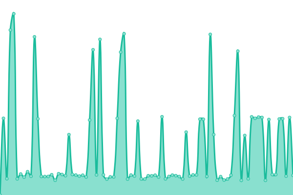

# [📈 Live Status](https://binusmayadown.reinhart1010.id): <!--live status--> **🟩 All systems operational**

This repository contains the open-source uptime monitor and status page for [Reinhart Previano Koentjoro](https://reinhart1010.id/), powered by [Upptime](https://github.com/upptime/upptime).

With [Upptime](https://upptime.js.org), you can get your own unlimited and free uptime monitor and status page, powered entirely by a GitHub repository. We use [Issues](https://github.com/reinhart1010/binusmayadown/issues) as incident reports, [Actions](https://github.com/reinhart1010/binusmayadown/actions) as uptime monitors, and [Pages](https://binusmayadown.reinhart1010.id) for the status page.

<!--start: status pages-->
<!-- This summary is generated by Upptime (https://github.com/upptime/upptime) -->
<!-- Do not edit this manually, your changes will be overwritten -->
<!-- prettier-ignore -->
| URL | Status | History | Response Time | Uptime |
| --- | ------ | ------- | ------------- | ------ |
|  [BINUSMAYA (Academic Services)](https://binusmaya.binus.ac.id/LoginAD.php) | 🟩 Up | [binusmaya-academic-services.yml](https://github.com/reinhart1010/binusmayadown/commits/HEAD/history/binusmaya-academic-services.yml) | 

 1030ms
     
 | 

<a href="https://binusmayadown.reinhart1010.id/history/binusmaya-academic-services">98.28%</a>
    

|  [BINUSMAYA (Learning Management System)](https://newbinusmaya.binus.ac.id) | 🟩 Up | [binusmaya-learning-management-system.yml](https://github.com/reinhart1010/binusmayadown/commits/HEAD/history/binusmaya-learning-management-system.yml) | 

 947ms
     
 | 

<a href="https://binusmayadown.reinhart1010.id/history/binusmaya-learning-management-system">99.84%</a>
    

|  [BINUS Mobile (Server 1)](https://mobileapi.apps.binus.edu) | 🟩 Up | [binus-mobile-server-1.yml](https://github.com/reinhart1010/binusmayadown/commits/HEAD/history/binus-mobile-server-1.yml) | 

 2971ms
     
 | 

<a href="https://binusmayadown.reinhart1010.id/history/binus-mobile-server-1">99.40%</a>
    

|  [BINUS Mobile (Server 2)](https://mobileapi2.apps.binus.edu) | 🟩 Up | [binus-mobile-server-2.yml](https://github.com/reinhart1010/binusmayadown/commits/HEAD/history/binus-mobile-server-2.yml) | 

 1001ms
     
 | 

<a href="https://binusmayadown.reinhart1010.id/history/binus-mobile-server-2">99.67%</a>
    

|  [BINUSMAYA Exam](https://exam.apps.binus.ac.id) | 🟩 Up | [binusmaya-exam.yml](https://github.com/reinhart1010/binusmayadown/commits/HEAD/history/binusmaya-exam.yml) | 

 975ms
     
 | 

<a href="https://binusmayadown.reinhart1010.id/history/binusmaya-exam">100.00%</a>
    

|  [BINUSMAYA Exam - Multiple Choice](https://socs1.binus.ac.id/tcexam/public/code/index.php) | 🟩 Up | [binusmaya-exam-multiple-choice.yml](https://github.com/reinhart1010/binusmayadown/commits/HEAD/history/binusmaya-exam-multiple-choice.yml) | 

 1198ms
     
 | 

<a href="https://binusmayadown.reinhart1010.id/history/binusmaya-exam-multiple-choice">100.00%</a>
    

|  [BINUSMAYA CDN (newcontent.binus.ac.id)](https://newcontent.binus.ac.id) | 🟩 Up | [binusmaya-cdn-newcontent-binus-ac-id.yml](https://github.com/reinhart1010/binusmayadown/commits/HEAD/history/binusmaya-cdn-newcontent-binus-ac-id.yml) | 

 1033ms
     
 | 

<a href="https://binusmayadown.reinhart1010.id/history/binusmaya-cdn-newcontent-binus-ac-id">100.00%</a>
    

|  [BINUSMAYA CDN (bm5cdn.azureedge.net)](https://bm5cdn.azureedge.net) | 🟩 Up | [binusmaya-cdn-bm5cdn-azureedge-net.yml](https://github.com/reinhart1010/binusmayadown/commits/HEAD/history/binusmaya-cdn-bm5cdn-azureedge-net.yml) | 

 1039ms
     
 | 

<a href="https://binusmayadown.reinhart1010.id/history/binusmaya-cdn-bm5cdn-azureedge-net">100.00%</a>
    

|  [Admission Online Frontend (AOF) 3 (BINUSIAN 2024 and below)](https://admissions.apps.binus.edu/admissions) | 🟩 Up | [admission-online-frontend-aof-3-binusian-2024-and-below.yml](https://github.com/reinhart1010/binusmayadown/commits/HEAD/history/admission-online-frontend-aof-3-binusian-2024-and-below.yml) | 

 1251ms
     
 | 

<a href="https://binusmayadown.reinhart1010.id/history/admission-online-frontend-aof-3-binusian-2024-and-below">100.00%</a>
    

|  [Admission Online Frontend (AOF) 4 (BINUSIAN 2025 and up)](https://newadmissions.apps.binus.edu/admissions) | 🟩 Up | [admission-online-frontend-aof-4-binusian-2025-and-up.yml](https://github.com/reinhart1010/binusmayadown/commits/HEAD/history/admission-online-frontend-aof-4-binusian-2025-and-up.yml) | 

 1581ms
     
 | 

<a href="https://binusmayadown.reinhart1010.id/history/admission-online-frontend-aof-4-binusian-2025-and-up">100.00%</a>
    

|  [Course Enrollment and Registration (bcs.binus.ac.id)](http://bcs.binus.ac.id) | 🟩 Up | [course-enrollment-and-registration-bcs-binus-ac-id.yml](https://github.com/reinhart1010/binusmayadown/commits/HEAD/history/course-enrollment-and-registration-bcs-binus-ac-id.yml) | 

 6798ms
     
 | 

<a href="https://binusmayadown.reinhart1010.id/history/course-enrollment-and-registration-bcs-binus-ac-id">100.00%</a>
    

|  [BINUSMAYA Praktikum (SLC Bluejack)](https://bluejack.binus.ac.id/binusmayalab/) | 🟩 Up | [binusmaya-praktikum-slc-bluejack.yml](https://github.com/reinhart1010/binusmayadown/commits/HEAD/history/binusmaya-praktikum-slc-bluejack.yml) | 

 1501ms
     
 | 

<a href="https://binusmayadown.reinhart1010.id/history/binusmaya-praktikum-slc-bluejack">100.00%</a>
    

|  [SLC Laboratory (laboratory.binus.ac.id)](https://laboratory.binus.ac.id/lab) | 🟩 Up | [slc-laboratory-laboratory-binus-ac-id.yml](https://github.com/reinhart1010/binusmayadown/commits/HEAD/history/slc-laboratory-laboratory-binus-ac-id.yml) | 

 1409ms
     
 | 

<a href="https://binusmayadown.reinhart1010.id/history/slc-laboratory-laboratory-binus-ac-id">100.00%</a>
    

|  [SLC Remote Lab (rlab.binus.ac.id)](https://rlab.apps.binus.ac.id/) | 🟩 Up | [slc-remote-lab-rlab-binus-ac-id.yml](https://github.com/reinhart1010/binusmayadown/commits/HEAD/history/slc-remote-lab-rlab-binus-ac-id.yml) | 

 1220ms
     
 | 

<a href="https://binusmayadown.reinhart1010.id/history/slc-remote-lab-rlab-binus-ac-id">100.00%</a>
    

|  [Laboratory Borrowing (labfacility.apps.binus.ac.id)](https://labfacility.apps.binus.ac.id/) | 🟩 Up | [laboratory-borrowing-labfacility-apps-binus-ac-id.yml](https://github.com/reinhart1010/binusmayadown/commits/HEAD/history/laboratory-borrowing-labfacility-apps-binus-ac-id.yml) | 

 1003ms
     
 | 

<a href="https://binusmayadown.reinhart1010.id/history/laboratory-borrowing-labfacility-apps-binus-ac-id">100.00%</a>
    

|  [Library and Knowledge Center (LKC)](http://library.binus.ac.id) | 🟩 Up | [library-and-knowledge-center-lkc.yml](https://github.com/reinhart1010/binusmayadown/commits/HEAD/history/library-and-knowledge-center-lkc.yml) | 

 4394ms
     
 | 

<a href="https://binusmayadown.reinhart1010.id/history/library-and-knowledge-center-lkc">99.63%</a>
    

|  [GreatNusa.com](https://greatnusa.com) | 🟩 Up | [great-nusa-com.yml](https://github.com/reinhart1010/binusmayadown/commits/HEAD/history/great-nusa-com.yml) | 

 3169ms
     
 | 

<a href="https://binusmayadown.reinhart1010.id/history/great-nusa-com">100.00%</a>
    

|  [BINUS CX (Class eXtension)](https://cx.apps.binus.ac.id) | 🟩 Up | [binus-cx-class-e-xtension.yml](https://github.com/reinhart1010/binusmayadown/commits/HEAD/history/binus-cx-class-e-xtension.yml) | 

 1830ms
     
 | 

<a href="https://binusmayadown.reinhart1010.id/history/binus-cx-class-e-xtension">100.00%</a>
    

|  [BINUS Entrepreneurship (BEC) Apps](https://entrepreneurship.apps.binus.ac.id) | 🟩 Up | [binus-entrepreneurship-bec-apps.yml](https://github.com/reinhart1010/binusmayadown/commits/HEAD/history/binus-entrepreneurship-bec-apps.yml) | 

 1204ms
     
 | 

<a href="https://binusmayadown.reinhart1010.id/history/binus-entrepreneurship-bec-apps">100.00%</a>
    

|  [Enrichment Apps](https://enrichment.apps.binus.ac.id) | 🟩 Up | [enrichment-apps.yml](https://github.com/reinhart1010/binusmayadown/commits/HEAD/history/enrichment-apps.yml) | 

 1295ms
     
 | 

<a href="https://binusmayadown.reinhart1010.id/history/enrichment-apps">100.00%</a>
    

|  [Activity Enrichment Apps](https://activity-enrichment.apps.binus.ac.id) | 🟩 Up | [activity-enrichment-apps.yml](https://github.com/reinhart1010/binusmayadown/commits/HEAD/history/activity-enrichment-apps.yml) | 

 952ms
     
 | 

<a href="https://binusmayadown.reinhart1010.id/history/activity-enrichment-apps">100.00%</a>
    

|  [Internship Apps](https://internship.apps.binus.ac.id) | 🟩 Up | [internship-apps.yml](https://github.com/reinhart1010/binusmayadown/commits/HEAD/history/internship-apps.yml) | 

 1174ms
     
 | 

<a href="https://binusmayadown.reinhart1010.id/history/internship-apps">100.00%</a>
    

|  [Apple Developer Academy Apps](https://developeracademy.apps.binus.ac.id) | 🟩 Up | [apple-developer-academy-apps.yml](https://github.com/reinhart1010/binusmayadown/commits/HEAD/history/apple-developer-academy-apps.yml) | 

 491ms
     
 | 

<a href="https://binusmayadown.reinhart1010.id/history/apple-developer-academy-apps">100.00%</a>
    

|  [Research Apps](https://research.apps.binus.ac.id) | 🟩 Up | [research-apps.yml](https://github.com/reinhart1010/binusmayadown/commits/HEAD/history/research-apps.yml) | 

 1210ms
     
 | 

<a href="https://binusmayadown.reinhart1010.id/history/research-apps">100.00%</a>
    

|  [Student Certification Apps](http://studentcertification.apps.binus.ac.id) | 🟩 Up | [student-certification-apps.yml](https://github.com/reinhart1010/binusmayadown/commits/HEAD/history/student-certification-apps.yml) | 

 1075ms
     
 | 

<a href="https://binusmayadown.reinhart1010.id/history/student-certification-apps">100.00%</a>
    

|  [Thesis Apps](https://thesis.apps.binus.ac.id) | 🟩 Up | [thesis-apps.yml](https://github.com/reinhart1010/binusmayadown/commits/HEAD/history/thesis-apps.yml) | 

 926ms
     
 | 

<a href="https://binusmayadown.reinhart1010.id/history/thesis-apps">100.00%</a>
    

|  [BINUS Career](https://binuscareer.com) | 🟩 Up | [binus-career.yml](https://github.com/reinhart1010/binusmayadown/commits/HEAD/history/binus-career.yml) | 

 2034ms
     
 | 

<a href="https://binusmayadown.reinhart1010.id/history/binus-career">100.00%</a>
    

|  [BISANARA](https://bisanara.com) | 🟩 Up | [bisanara.yml](https://github.com/reinhart1010/binusmayadown/commits/HEAD/history/bisanara.yml) | 

 4911ms
     
 | 

<a href="https://binusmayadown.reinhart1010.id/history/bisanara">100.00%</a>
    

|  [School of Computer Science Competitive Programming Quiz](https://socs1.binus.ac.id/quiz/public/) | 🟩 Up | [school-of-computer-science-competitive-programming-quiz.yml](https://github.com/reinhart1010/binusmayadown/commits/HEAD/history/school-of-computer-science-competitive-programming-quiz.yml) | 

 940ms
     
 | 

<a href="https://binusmayadown.reinhart1010.id/history/school-of-computer-science-competitive-programming-quiz">100.00%</a>
    

|  [BINUSIAN Blog](http://blog.binusian.org) | 🟩 Up | [binusian-blog.yml](https://github.com/reinhart1010/binusmayadown/commits/HEAD/history/binusian-blog.yml) | 

 1197ms
     
 | 

<a href="https://binusmayadown.reinhart1010.id/history/binusian-blog">100.00%</a>
    

|  [BINUS Youth Festival (BYFest)](https://student.binus.ac.id/byfest) | 🟩 Up | [binus-youth-festival-by-fest.yml](https://github.com/reinhart1010/binusmayadown/commits/HEAD/history/binus-youth-festival-by-fest.yml) | 

 2108ms
     
 | 

<a href="https://binusmayadown.reinhart1010.id/history/binus-youth-festival-by-fest">100.00%</a>
    

|  [Competitive Programming Competitions - Homepage](https://competition.binus.ac.id/portal/) | 🟩 Up | [competitive-programming-competitions-homepage.yml](https://github.com/reinhart1010/binusmayadown/commits/HEAD/history/competitive-programming-competitions-homepage.yml) | 

 1186ms
     
 | 

<a href="https://binusmayadown.reinhart1010.id/history/competitive-programming-competitions-homepage">99.80%</a>
    

|  [Competitive Programming Competitions - DOMJudge Instance](https://competition.binus.ac.id/contest/public) | 🟩 Up | [competitive-programming-competitions-dom-judge-instance.yml](https://github.com/reinhart1010/binusmayadown/commits/HEAD/history/competitive-programming-competitions-dom-judge-instance.yml) | 

 3614ms
     
 | 

<a href="https://binusmayadown.reinhart1010.id/history/competitive-programming-competitions-dom-judge-instance">100.00%</a>
    

|  [Scribees](https://binus.ac.id/scribees/login/) | 🟩 Up | [scribees.yml](https://github.com/reinhart1010/binusmayadown/commits/HEAD/history/scribees.yml) | 

 1349ms
     
 | 

<a href="https://binusmayadown.reinhart1010.id/history/scribees">100.00%</a>
    

|  [Collabees](https://dmd.binus.ac.id/collabees/) | 🟩 Up | [collabees.yml](https://github.com/reinhart1010/binusmayadown/commits/HEAD/history/collabees.yml) | 

 1450ms
     
 | 

<a href="https://binusmayadown.reinhart1010.id/history/collabees">100.00%</a>
    

|  [Vairbees (Virtual Expo)](https://vairbees.binus.edu) | 🟩 Up | [vairbees-virtual-expo.yml](https://github.com/reinhart1010/binusmayadown/commits/HEAD/history/vairbees-virtual-expo.yml) | 

 2308ms
     
 | 

<a href="https://binusmayadown.reinhart1010.id/history/vairbees-virtual-expo">100.00%</a>
    

|  [BINUS Graduate Attribute Assessment Apps](https://bga.apps.binus.ac.id/) | 🟩 Up | [binus-graduate-attribute-assessment-apps.yml](https://github.com/reinhart1010/binusmayadown/commits/HEAD/history/binus-graduate-attribute-assessment-apps.yml) | 

 909ms
     
 | 

<a href="https://binusmayadown.reinhart1010.id/history/binus-graduate-attribute-assessment-apps">100.00%</a>
    

|  [BINUS Integrated Survey Reporting Application (ISRA) (qmc.apps.binus.ac.id)](https://qmc.apps.binus.ac.id/isra) | 🟩 Up | [binus-integrated-survey-reporting-application-isra-qmc-apps-binus-ac-id.yml](https://github.com/reinhart1010/binusmayadown/commits/HEAD/history/binus-integrated-survey-reporting-application-isra-qmc-apps-binus-ac-id.yml) | 

 969ms
     
 | 

<a href="https://binusmayadown.reinhart1010.id/history/binus-integrated-survey-reporting-application-isra-qmc-apps-binus-ac-id">100.00%</a>
    

|  [BINUS ISRA API Server 1](https://qmc.apps.binus.ac.id/api/v1/loadSetting) | 🟩 Up | [binus-isra-api-server-1.yml](https://github.com/reinhart1010/binusmayadown/commits/HEAD/history/binus-isra-api-server-1.yml) | 

 240ms
     
 | 

<a href="https://binusmayadown.reinhart1010.id/history/binus-isra-api-server-1">100.00%</a>
    

|  [BINUS ISRA API Server 2](https://qmcapi2.apps.binus.ac.id/isra/api) | 🟩 Up | [binus-isra-api-server-2.yml](https://github.com/reinhart1010/binusmayadown/commits/HEAD/history/binus-isra-api-server-2.yml) | 

 706ms
     
 | 

<a href="https://binusmayadown.reinhart1010.id/history/binus-isra-api-server-2">100.00%</a>
    

<!--end: status pages-->

[**Visit our status website →**](https://binusmayadown.reinhart1010.id)

## 📄 License

- Powered by: [Upptime](https://github.com/upptime/upptime)
- Code: [MIT](./LICENSE) © [Reinhart Previano Koentjoro](https://reinhart1010.id/)
- Data in the `./history` directory: [Open Database License](https://opendatacommons.org/licenses/odbl/1-0/)
